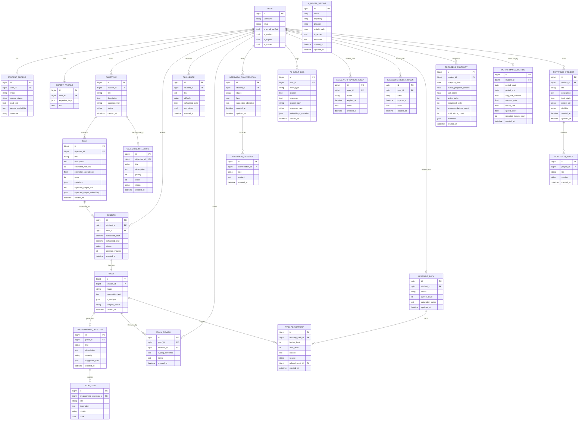

# ERD (Entity Relationship Diagram)

```mermaid
erDiagram
    USER {
      bigint id PK
      string username
      string email
      bool is_email_verified
      bool is_student
      bool is_expert
      bool is_trainer
    }

    STUDENT_PROFILE {
      bigint id PK
      bigint user_id FK
      string major
      string current_status
      text goal_text
      json weekly_availability
      string timezone
    }

    EXPERT_PROFILE {
      bigint id PK
      bigint user_id FK
      json expertise_tags
      text bio
    }

    OBJECTIVE {
      bigint id PK
      bigint student_id FK
      string title
      text description
      string suggested_by
      string status
      datetime created_at
    }

    TASK {
      bigint id PK
      bigint objective_id FK
      string title
      text description
      int estimated_minutes
      float estimation_confidence
      int order
      json metadata
      text expected_output_text
      json expected_output_embedding
      datetime created_at
    }

    SESSION {
      bigint id PK
      bigint student_id FK
      bigint task_id FK
      datetime scheduled_start
      datetime scheduled_end
      string status
      int duration_minutes
      datetime created_at
    }

    PROOF {
      bigint id PK
      bigint session_id FK
      string image
      text explanation_text
      json ai_analysis
      string analysis_status
      datetime created_at
    }

    PROGRAMMING_QUESTION {
      bigint id PK
      bigint proof_id FK
      string title
      text description
      string severity
      json suggested_fixes
      datetime created_at
    }

    TODO_ITEM {
      bigint id PK
      bigint programming_question_id FK
      string title
      text description
      string priority
      bool done
    }

    CHALLENGE {
      bigint id PK
      bigint student_id FK
      text text
      string difficulty
      date scheduled_date
      bool completed
      datetime created_at
    }

    ADMIN_REVIEW {
      bigint id PK
      bigint proof_id FK
      bigint reviewer_id FK
      bool is_bug_confirmed
      text notes
      datetime created_at
    }

    INTERVIEW_CONVERSATION {
      bigint id PK
      bigint student_id FK
      string status
      json facts
      json suggested_objective
      datetime created_at
      datetime updated_at
    }

    INTERVIEW_MESSAGE {
      bigint id PK
      bigint conversation_id FK
      string role
      text content
      datetime created_at
    }

    AI_EVENT_LOG {
      bigint id PK
      bigint user_id FK
      string event_type
      text prompt
      text response
      string prompt_hash
      string response_hash
      json embeddings_metadata
      datetime created_at
    }

    AI_MODEL_WEIGHT {
      bigint id PK
      string name
      string capability
      string provider
      string weight_path
      bool is_active
      json metadata
      datetime created_at
      datetime updated_at
    }

    EMAIL_VERIFICATION_TOKEN {
      bigint id PK
      bigint user_id FK
      string token
      datetime expires_at
      bool used
      datetime created_at
    }

    PASSWORD_RESET_TOKEN {
      bigint id PK
      bigint user_id FK
      string token
      datetime expires_at
      bool used
      datetime created_at
    }

    OBJECTIVE_MILESTONE {
      bigint id PK
      bigint objective_id FK
      string title
      text description
      int priority
      int order
      string status
      datetime created_at
    }

    LEARNING_PATH {
      bigint id PK
      bigint student_id FK
      string status
      int current_level
      text adaptation_notes
      datetime updated_at
    }

    PATH_ADJUSTMENT {
      bigint id PK
      bigint learning_path_id FK
      int before_level
      int after_level
      text reason
      string source
      bigint related_proof_id FK
      datetime created_at
    }

    PROGRESS_SNAPSHOT {
      bigint id PK
      bigint student_id FK
      date snapshot_date
      float overall_progress_percent
      float skill_score
      int active_tasks
      int completed_tasks
      int recommendations_count
      int notifications_count
      json metadata
      datetime created_at
    }

    PERFORMANCE_METRIC {
      bigint id PK
      bigint student_id FK
      date period_start
      date period_end
      float avg_task_minutes
      float success_rate
      float failure_rate
      float speed_score
      int repeated_issues_count
      datetime created_at
    }

    PORTFOLIO_PROJECT {
      bigint id PK
      bigint student_id FK
      string title
      text description
      json tech_stack
      string project_url
      string visibility
      datetime created_at
      datetime updated_at
    }

    PORTFOLIO_ASSET {
      bigint id PK
      bigint project_id FK
      string file
      string caption
      datetime created_at
    }

    USER ||--o| STUDENT_PROFILE : has
    USER ||--o| EXPERT_PROFILE : has
    USER ||--o{ OBJECTIVE : owns
    OBJECTIVE ||--o{ TASK : contains
    USER ||--o{ SESSION : attends
    TASK ||--o{ SESSION : scheduled_as
    SESSION ||--|| PROOF : has_one
    PROOF ||--o{ PROGRAMMING_QUESTION : generates
    PROGRAMMING_QUESTION ||--o{ TODO_ITEM : contains
    USER ||--o{ CHALLENGE : receives
    PROOF ||--o{ ADMIN_REVIEW : reviewed_by
    USER ||--o{ ADMIN_REVIEW : writes
    USER ||--o{ INTERVIEW_CONVERSATION : starts
    INTERVIEW_CONVERSATION ||--o{ INTERVIEW_MESSAGE : includes
    USER ||--o{ AI_EVENT_LOG : logs
    USER ||--o{ EMAIL_VERIFICATION_TOKEN : verifies_with
    USER ||--o{ PASSWORD_RESET_TOKEN : resets_with
    OBJECTIVE ||--o{ OBJECTIVE_MILESTONE : decomposes_to
    USER ||--o| LEARNING_PATH : adapts_with
    LEARNING_PATH ||--o{ PATH_ADJUSTMENT : tracks
    PROOF ||--o{ PATH_ADJUSTMENT : triggers
    USER ||--o{ PROGRESS_SNAPSHOT : snapshots
    USER ||--o{ PERFORMANCE_METRIC : measured_by
    USER ||--o{ PORTFOLIO_PROJECT : owns
    PORTFOLIO_PROJECT ||--o{ PORTFOLIO_ASSET : contains
```
