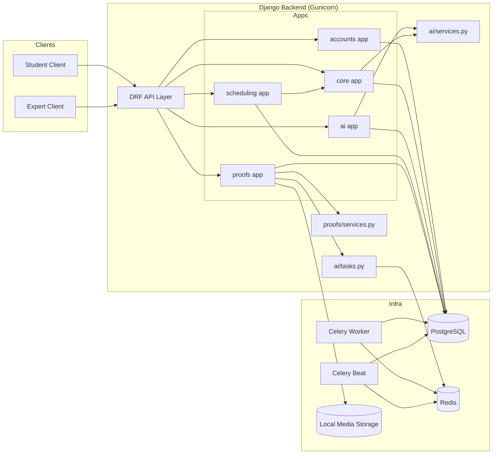

# Component Diagram

```mermaid
flowchart LR
  subgraph Clients
    Student[Student Client]
    Expert[Expert Client]
  end

  Student --> API
  Expert --> API

  subgraph Django["Django Backend (Gunicorn)"]
    API[DRF API Layer]

    subgraph Apps
      ACC[accounts app]
      CORE[core app]
      AI[ai app]
      SCH[scheduling app]
      PRF[proofs app]
    end

    API --> ACC
    API --> CORE
    API --> AI
    API --> SCH
    API --> PRF

    AI --> AISVC[ai/services.py]
    PRF --> PRFSVC[proofs/services.py]
    PRF --> CELERYTASK[ai/tasks.py]
    SCH --> CORE
    CORE --> AISVC
  end

  subgraph Infra
    DB[(PostgreSQL)]
    REDIS[(Redis)]
    CELERY[Celery Worker]
    BEAT[Celery Beat]
    MEDIA[(Local Media Storage)]
  end

  ACC --> DB
  CORE --> DB
  AI --> DB
  SCH --> DB
  PRF --> DB

  PRF --> MEDIA
  CELERYTASK --> REDIS
  CELERY --> REDIS
  BEAT --> REDIS
  CELERY --> DB
  BEAT --> DB
```
