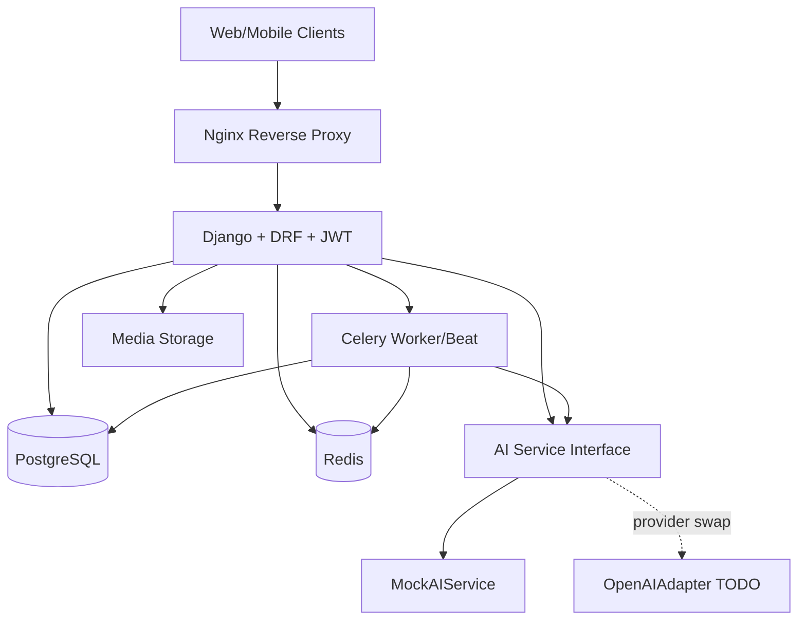

# Block Architecture Diagram

## Main processing blocks
- Authentication and role checks (JWT + permissions)
- Interview and objective recommendation
- Task estimation and scheduling
- Proof ingestion and analysis
- Bug remediation generation (question + todos)
- Trainer review and escalation
- Daily adaptive challenge generation
