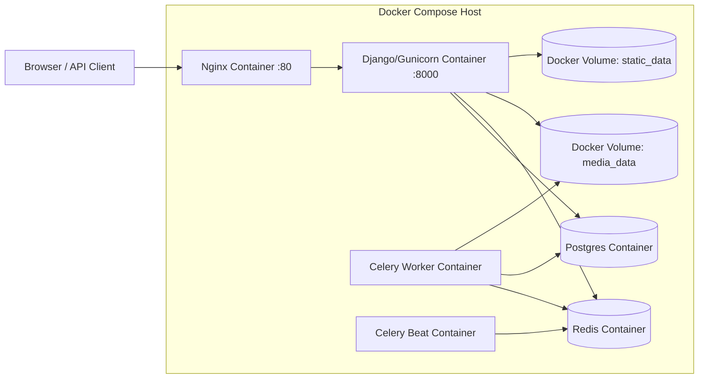

# Deployment Diagram

```mermaid
flowchart LR
  User[Browser / API Client]

  subgraph DockerHost["Docker Compose Host"]
    Nginx[Nginx Container :80]
    Web[Django/Gunicorn Container :8000]
    Worker[Celery Worker Container]
    Beat[Celery Beat Container]
    Postgres[(Postgres Container)]
    Redis[(Redis Container)]
    Media[(Docker Volume: media_data)]
    Static[(Docker Volume: static_data)]
  end

  User --> Nginx
  Nginx --> Web
  Web --> Postgres
  Web --> Redis
  Web --> Media
  Web --> Static
  Worker --> Redis
  Worker --> Postgres
  Worker --> Media
  Beat --> Redis
```

## Runtime notes
- Public entrypoint: Nginx
- App process: Gunicorn running Django
- Async jobs: Celery worker + beat
- Shared storage: media/static Docker volumes
