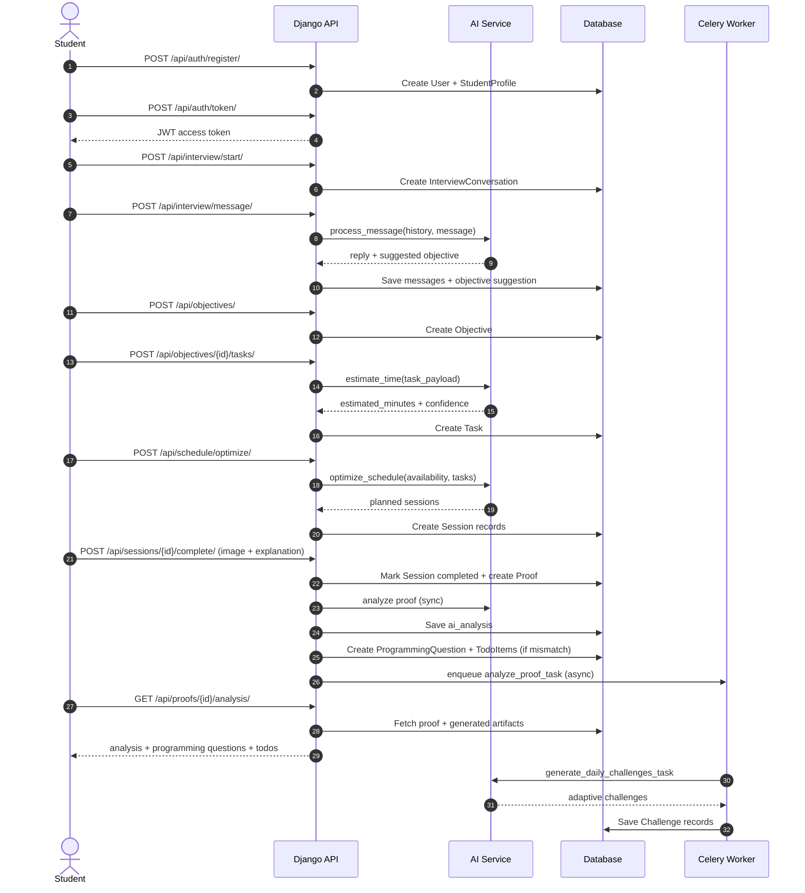

# Sequence Diagram (Full Demo Flow)

```mermaid
sequenceDiagram
  autonumber
  actor Student
  participant API as Django API
  participant AI as AI Service
  participant DB as Database
  participant CW as Celery Worker

  Student->>API: POST /api/auth/register/
  API->>DB: Create User + StudentProfile
  Student->>API: POST /api/auth/token/
  API-->>Student: JWT access token

  Student->>API: POST /api/interview/start/
  API->>DB: Create InterviewConversation
  Student->>API: POST /api/interview/message/
  API->>AI: process_message(history, message)
  AI-->>API: reply + suggested objective
  API->>DB: Save messages + objective suggestion

  Student->>API: POST /api/objectives/
  API->>DB: Create Objective

  Student->>API: POST /api/objectives/{id}/tasks/
  API->>AI: estimate_time(task_payload)
  AI-->>API: estimated_minutes + confidence
  API->>DB: Create Task

  Student->>API: POST /api/schedule/optimize/
  API->>AI: optimize_schedule(availability, tasks)
  AI-->>API: planned sessions
  API->>DB: Create Session records

  Student->>API: POST /api/sessions/{id}/complete/ (image + explanation)
  API->>DB: Mark Session completed + create Proof
  API->>AI: analyze proof (sync)
  API->>DB: Save ai_analysis
  API->>DB: Create ProgrammingQuestion + TodoItems (if mismatch)
  API->>CW: enqueue analyze_proof_task (async)

  Student->>API: GET /api/proofs/{id}/analysis/
  API->>DB: Fetch proof + generated artifacts
  API-->>Student: analysis + programming questions + todos

  CW->>AI: generate_daily_challenges_task
  AI-->>CW: adaptive challenges
  CW->>DB: Save Challenge records
```
