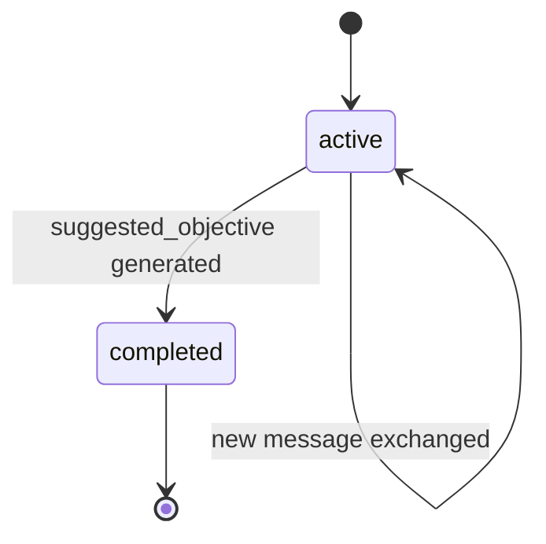
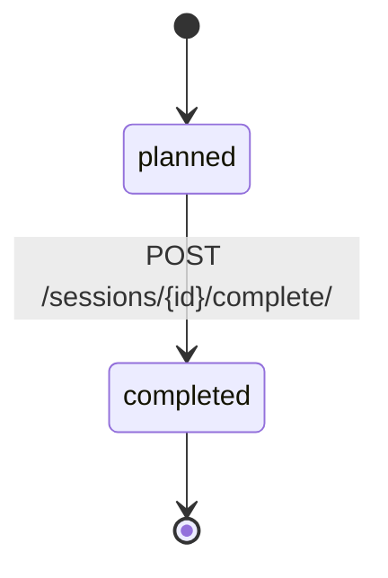
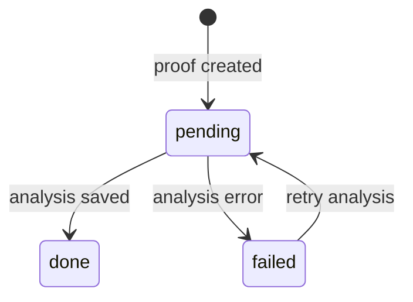

# State Diagrams

## Interview Conversation

```mermaid
stateDiagram-v2
  [*] --> active
  active --> completed: suggested_objective generated
  active --> active: new message exchanged
  completed --> [*]
```

## Session Lifecycle

```mermaid
stateDiagram-v2
  [*] --> planned
  planned --> completed: POST /sessions/{id}/complete/
  completed --> [*]
```

## Proof Lifecycle

```mermaid
stateDiagram-v2
  [*] --> pending: proof created
  pending --> done: analysis saved
  pending --> failed: analysis error
  failed --> pending: retry analysis
```
